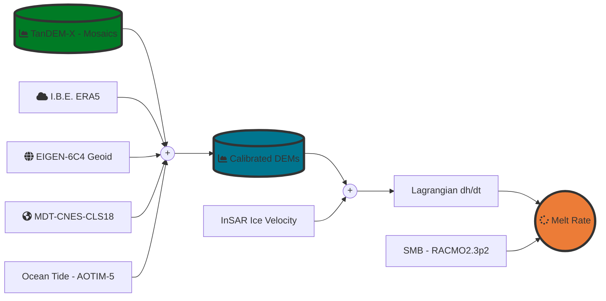

# ciraci_rignot_et_al_2022
This package is a Python implementation of the melt rate estimation method 
described in the paper: Ciraci, Rignot, et. al (2022) - Need To Update the Reference

[![Language][]][1] [![License][]][2]


---
### Melt Rate Estimation in a Lagrangian Framework

Ice shelf basal melt rate can be deduced from the Eulerian description of mass conservation for a column of ice (Rignot et al. 2013): 

```math
\frac{\partial H}{\partial t} =  - \nabla \cdot (H \bar{v}) + \dot{a} + \dot{b} (1)$$ 
```
Where $H$ is the ice thickness, $\bar{v}$ is the ice velocity vector, $\dot{a}$ the surface mass balance, $\dot{b}$ 
the average melt rate,  and $\frac{\partial H}{\partial t}$ the ice thickness change rate, in meters per year,
measured in a fixed reference frame. Melt rate estimates based on this equation are noisy due to the temporal 
aliasing of the signal associated with the advection along the direction of ice flow of surface heterogeneities 
(e.g., cracks and vertical undulations in surface elevation). Estimates obtained in this framework require, for 
this reason, significant smoothing that leads to a loss in spatial details and resolution.
The temporal aliasing effect can be avoided by solving the mass conservation equation in a **Lagrangian Framework** 
in which the reference frame moves with the ice surface (Moholdt et al. 2014, Shean et al. 2019). In this framework, 
when ice can be assumed on  flotation, we compute the average melt rate b by solving the modified mass conservation 
equation:

```math
\dot{b} = - \left (\frac{\partial h}{\partial t} + (h -d)(\nabla \cdot \bar{v})\right )  \left ( \frac{\rho_{water}}{\rho _{water} - \rho _{ice}}\right ) - \dot{a} (2)
```
Where $h$ is the ice surface elevation with respect to mean sea level, $\frac{\partial h}{\partial t}$ is its temporal 
derivative, $d$ the firn air content, $\rho _{water}$ density of seawater, $\rho _{ice}$ density of ice, 
and $\nabla \cdot \bar{v}$ the ice flow divergence.
We solve equation (2) by following the approach presented by (Shean et al. 2019).
We compute h, by subtracting from TanDEM-X elevation data the geoid offset 
(geoid height above the reference ellipsoid WGS84) from the EIGEN-6C4 model (Foerste et al. 2014) and the
Mean Dynamic Ocean topography (mean sea surface height above geoid) by employing estimates from the 
MDT-CNES-CLS18 dataset (Mulet et al. 2021). 
We, furthermore, correct elevation data for vertical displacements due to ocean tides and atmospheric pressure. 
Ocean tides at the outlet of the fjord of the glacier are estimated using outputs from the
Arctic Ocean Tidal Inverse Model, 5km  (AOTIM5) (Padman et al. 2011) computed via the PyTDM python 
module (Sutterley et al. 2019). Dynamic Atmospheric effect (inverse barometer effect) due to changes in 
pressure is computed by employing hourly Mean Sea Level pressure from the fifth-generation global reanalysis from 
the European Centre for Medium-Range Weather Forecasts ERA5 (Hersbach et al. 2020). We estimate the contribution of a 
over the ice shelf area by employing outputs from the Regional Atmospheric Climate Model Version p2.3 (RACMOv2.3p).
Finally, we use the annual ice velocity mosaic from (Rignot et al. 2009) to assess the ice flow divergence.
Following Shean et al. 2019, to calculate $\frac{\partial h}{\partial t}$ from a pair of DEMs, we track each ice particle (pixel) in the 
earlier DEM to its corresponding downstream location where it intersects a later DEM. 
We update the particle location with a time step equal to one month using the annual velocity mosaics. 
We use the observed cumulative ∂h/∂t to assess the evolving particle elevation h along its path. 
Ice flow divergence is also sampled at each step and used to compute h∇∙v correctly integrated along the particle's 
full path (see equation 12 in Shean et al. 2019). We extract the surface mass balance contribution to equation (2) 
at the particle path midpoint, and we finally assign the estimated basal melt rate to the same 
location [Midpoint Approach].


### Lagrangian Workflow


### Setup Python Environment

1. Setup minimal **conda** installation using [Miniconda][]

2. Create Python Virtual Environment

    > -   Creating an environment with commands ([Link][]);
    > -   Creating an environment from an environment.yml file
    >     ([Link][2])  -> **Recommended**;

#### PYTHON DEPENDENCIES:
- [rasterio: access to geospatial raster data][]
- [gdal: Python's GDAL binding.][]
- [fiona: Fiona is GDAL’s neat and nimble vector API for Python programmers.][]
- [numpy: The fundamental package for scientific computing with Python.][]
- [xarray: Labelled multi-dimensional arrays in Python.][]
- [matplotlib: Library for creating static, animated, and interactive visualizations in Python.][]
- [tqdm: A Fast, Extensible Progress Bar for Python and CLI.][]
- [necdft4: Provides an object-oriented python interface to the netCDF version 4 library.][]
- [PyTMD: Python package for the analysis of tidal data.][]

[Language]: https://img.shields.io/badge/python%20-3.7%2B-brightgreen
[License]: https://img.shields.io/badge/license-MIT-green.svg
[1]: ..%20image::%20https://www.python.org/
[Miniconda]: https://docs.conda.io/en/latest/miniconda.html
[Link]: https://docs.conda.io/projects/conda/en/latest/user-guide/tasks/manage-environments.html#creating-an-environment-with-commands
[2]: https://docs.conda.io/projects/conda/en/latest/user-guide/tasks/manage-environments.html#creating-an-environment-from-an-environment-yml-file

[xarray: Labelled multi-dimensional arrays in Python.]:https://docs.xarray.dev
[rasterio: access to geospatial raster data]:https://rasterio.readthedocs.io/en/latest/
[gdal: Python's GDAL binding.]: https://gdal.org/index.html
[matplotlib: Library for creating static, animated, and interactive visualizations in Python.]:https://matplotlib.org
[tqdm: A Fast, Extensible Progress Bar for Python and CLI.]: https://github.com/tqdm/tqdm
[necdft4: Provides an object-oriented python interface to the netCDF version 4 library.]:https://pypi.org/project/netCDF4/
[fiona: Fiona is GDAL’s neat and nimble vector API for Python programmers.]:https://fiona.readthedocs.io/en/latest/
[numpy: The fundamental package for scientific computing with Python.]:https://numpy.org
[PyTMD: Python package for the analysis of tidal data.]: https://github.com/tsutterley/pyTMD
