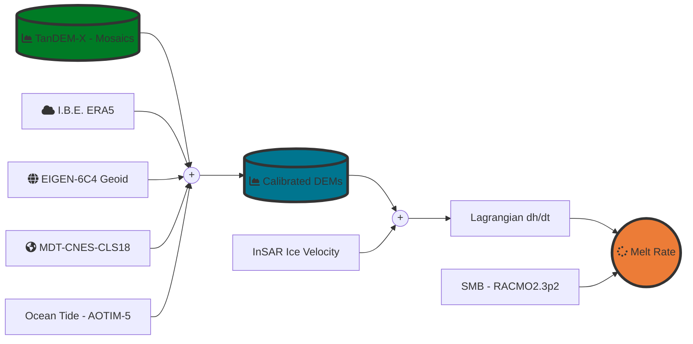

## Ice Shelf Basal Melt Rate Estimation in a Lagrangian Framework
[![Language][]][1] [![License][]][2]
[](https://zenodo.org/badge/latestdoi/575571644)

The repository contains a set of scripts that can be used to estimate ice shelf basal melt using time-tagged Digital Elevation Models from the DLR TanDEM-X mission.
For more details see: Ciraci, Rignot, et. al (2022) - Need To Update the Reference.

---
### Background:

Ice shelf basal melt rate can be deduced from the **Eulerian description of mass conservation** for a 
column of ice (Rignot et al. [2013](https://www.science.org/doi/10.1126/science.1235798)): 

```math
\frac{\partial H}{\partial t} =  - \nabla \cdot (H \bar{v}) + \dot{a} + \dot{b}\ (1)$$ 
```
Where $H$ is the ice thickness, $\bar{v}$ is the ice velocity vector, $\dot{a}$ the surface mass balance, $\dot{b}$ 
the average melt rate, and $\frac{\partial H}{\partial t}$ the ice thickness change rate, in meters per year,
measured in a fixed reference frame. Melt rate estimates based on this equation are noisy due to the temporal 
aliasing of the signal associated with the advection along the direction of ice flow of surface heterogeneities 
(e.g., cracks and vertical undulations in surface elevation). Estimates obtained in this framework require, for 
this reason, significant smoothing that leads to a loss in spatial details and resolution.
The temporal aliasing effect can be avoided by solving the mass conservation equation in a **Lagrangian Framework** 
in which the reference frame moves with the ice surface 
(Moholdt et al. [2014](https://agupubs.onlinelibrary.wiley.com/doi/full/10.1002/2014JF003171), 
Shean et al. [2019](https://tc.copernicus.org/articles/13/2633/2019/)). In this framework, 
when ice can be assumed on  flotation, the average melt rate $\dot{b}$ can be computed by solving the modified mass conservation 
equation:

```math
\dot{b} = - \left (\frac{\partial h}{\partial t} + (h - d)(\nabla \cdot \bar{v})\right )  \left ( \frac{\rho_{water}}{\rho _{water} - \rho _{ice}}\right ) - \dot{a}\ (2)
```
Where $h$ is the ice surface elevation with respect to mean sea level, $\frac{\partial h}{\partial t}$ is its temporal 
derivative, $d$ the firn air content, $\rho _{water}$ density of seawater, $\rho _{ice}$ density of ice, 
and $\nabla \cdot \bar{v}$ the ice flow divergence.

Equation (2) can be solved by following the steps presented below:

1. Compute $h$, by subtracting from TanDEM-X elevation data:
   - the geoid offset (geoid height above the reference ellipsoid WGS84) from the EIGEN-6C4 model (Foerste et al. [2014](http://icgem.gfz-potsdam.de/Foerste-et-al-EIGEN-6C4.pdf)) and the
   - Mean Dynamic Ocean topography (mean sea surface height above geoid) by employing estimates from the [MDT-CNES-CLS18](https://www.aviso.altimetry.fr/en/data/products/auxiliary-products/mdt.html) dataset (Mulet et al. [2021](https://os.copernicus.org/articles/17/789/2021/)). 
   - Vertical displacements due to ocean tides and atmospheric pressure.
     - Ocean tides at the outlet of the fjord of the glacier are estimated using outputs from the
     Arctic Ocean Tidal Inverse Model, 5km  ([AOTIM5](https://www.esr.org/research/polar-tide-models/list-of-polar-tide-models/aotim-5/)) (Padman et al. [2011](https://agupubs.onlinelibrary.wiley.com/doi/full/10.1029/2011JC006949)) computed via the [PyTDM](https://github.com/tsutterley/pyTMD) python 
     module (Sutterley et al. [2019](https://tc.copernicus.org/articles/13/1801/2019/)). 

   - Dynamic Atmospheric effect (inverse barometer effect) due to changes in pressure is computed 
   by employing hourly Mean Sea Level pressure from the fifth-generation global reanalysis from 
   the European Centre for Medium-Range Weather Forecasts [ERA5](https://www.ecmwf.int/en/forecasts/datasets/reanalysis-datasets/era5) (Hersbach et al. [2020](https://rmets.onlinelibrary.wiley.com/doi/10.1002/qj.3803)). 
   
2. Compute Surface Mass Balance over the ice shelf ($\dot{a}$) by employing outputs from the Regional Atmospheric Climate Model Version ([RACMO](https://www.projects.science.uu.nl/iceclimate/models/racmo-model.php)).
      
3. Use ice velocity mosaic from Rignot et al. [2009](https://agupubs.onlinelibrary.wiley.com/doi/full/10.1029/2012GL051634) to assess the ice flow divergence.


To compute the Lagrangian elevation chnage ($\frac{\partial h}{\partial t}$) from a pair 
of DEMs,  the path of each ice particle (pixel) in the earlier DEM need to be tracked 
to its corresponding downstream location  where it intersects a later DEM. 
Ice velocity mosaics can be used to update the particle location with a time step equal to one month. 
we use the observed cumulative $\frac{\partial h}{\partial t}$ to assess the evolving particle elevation $h$ '
along its path. 
Ice flow divergence has to be sampled at each step and used to compute $(h - d)(\nabla \cdot \bar{v})$
correctly integrated along the particle's  full path (see equation 12 in Shean et al. [2019](https://tc.copernicus.org/articles/13/2633/2019/)).


### Lagrangian Workflow

----
#### Quick Run:
 - Reproject/Reinterpolate TanDEM-X DEMs to UTM 3413:
    > ``` bash
    > python tandemx_proc/reproject_dem_rasterio.py 
    > ```
 - Convert TanDEM-X data to elevation w.r.t. mean sea level:
    > ``` bash
    >   python tandemx_proc/dem_tdx_iceshelf_corrections_compute.py
    >   ```
 - Compute daily Mosaics:
    > ``` bash
    >   python tandemx_proc/dem_tdx_iceshelf_mosaic_compute.py
    >   ```
 - Compute Melt Rate:
    > ``` bash
    >   python basal_melt_compute_lagrangian.py
    >   ```

----
### Setup Python Environment

1. Setup minimal **conda** installation using [Miniconda][]

2. Create Python Virtual Environment

    > -   Creating an environment with commands ([Link][]);
    > -   Creating an environment from an environment.yml file
    >     ([Link][2])  -> **Recommended**;

#### PYTHON DEPENDENCIES:
- [rasterio: access to geospatial raster data][]
- [gdal: Python's GDAL binding.][]
- [fiona: Fiona is GDAL’s neat and nimble vector API for Python programmers.][]
- [numpy: The fundamental package for scientific computing with Python.][]
- [pandas: Python Data Analysis Library.][]
- [geopandas: add support for geographic data to pandas objects.][]
- [xarray: Labelled multi-dimensional arrays in Python.][]
- [matplotlib: Library for creating static, animated, and interactive visualizations in Python.][]
- [tqdm: A Fast, Extensible Progress Bar for Python and CLI.][]
- [necdft4: Provides an object-oriented python interface to the netCDF version 4 library.][]
- [pandas: Python Data Analysis Library.][]
- [PyTMD: Python package for the analysis of tidal data.][]

[Language]: https://img.shields.io/badge/python%20-3.7%2B-brightgreen
[License]: https://img.shields.io/badge/license-MIT-green.svg
[1]: ..%20image::%20https://www.python.org/
[Miniconda]: https://docs.conda.io/en/latest/miniconda.html
[Link]: https://docs.conda.io/projects/conda/en/latest/user-guide/tasks/manage-environments.html#creating-an-environment-with-commands
[2]: https://docs.conda.io/projects/conda/en/latest/user-guide/tasks/manage-environments.html#creating-an-environment-from-an-environment-yml-file

[xarray: Labelled multi-dimensional arrays in Python.]:https://docs.xarray.dev
[rasterio: access to geospatial raster data]:https://rasterio.readthedocs.io/en/latest/
[gdal: Python's GDAL binding.]: https://gdal.org/index.html
[tqdm: A Fast, Extensible Progress Bar for Python and CLI.]: https://github.com/tqdm/tqdm
[necdft4: Provides an object-oriented python interface to the netCDF version 4 library.]:https://pypi.org/project/netCDF4/
[fiona: Fiona is GDAL’s neat and nimble vector API for Python programmers.]:https://fiona.readthedocs.io/en/latest/
[numpy: The fundamental package for scientific computing with Python.]:https://numpy.org
[PyTMD: Python package for the analysis of tidal data.]: https://github.com/tsutterley/pyTMD
[pandas: Python Data Analysis Library.]:https://pandas.pydata.org/
[geopandas: add support for geographic data to pandas objects.]:https://geopandas.org/en/stable/
[matplotlib: Library for creating static, animated, and interactive visualizations in Python.]:https://matplotlib.org
